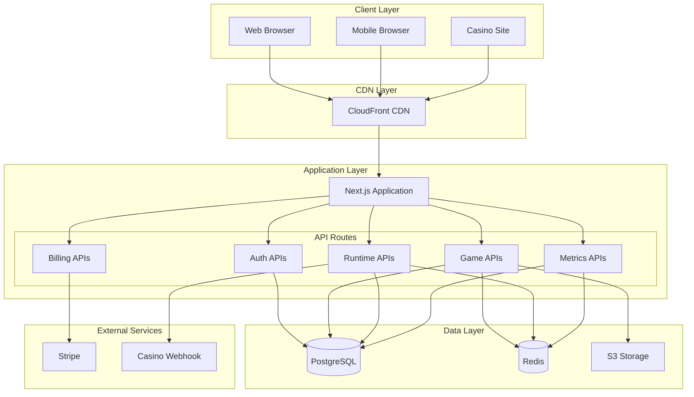

# Design Document

## Overview

The Slot Game Builder is a multi-tenant SaaS platform built on Next.js that enables casino owners to create, preview, and deploy HTML5 slot games through a visual interface. The system follows a microservices-oriented architecture within a monolithic Next.js application, leveraging API routes for backend functionality, PostgreSQL for persistent data, Redis for caching and real-time features, and AWS services for asset storage and delivery.

The platform serves three distinct user flows: the game creation workflow for casino owners, the game runtime for players, and the analytics dashboard for performance monitoring. Each flow is optimized for its specific performance and scalability requirements.

## Architecture

### High-Level Architecture



### System Components

**Frontend Layer:**
- Next.js 15 with TypeScript for type safety
- Tailwind CSS + shadcn/ui for consistent UI components
- GSAP for game animations and transitions
- Responsive design supporting desktop and mobile viewports

**API Layer:**
- Next.js API routes providing RESTful endpoints
- JWT-based authentication with 1-hour expiration
- Rate limiting and input validation middleware
- Structured error handling and logging

**Data Layer:**
- PostgreSQL 15 as primary database with Prisma 6 ORM
- Redis 7 for session caching, real-time metrics, and pub/sub
- S3 for asset storage with CloudFront distribution
- Database connection pooling for performance

**External Integrations:**
- Stripe for subscription billing and payment processing
- Casino webhook integration for balance verification
- AWS CDK for infrastructure as code

## Components and Interfaces

### Authentication Service

**Interface:**
```typescript
interface AuthService {
  register(email: string, password: string): Promise<{ jwt: string }>
  login(email: string, password: string): Promise<{ jwt: string }>
  validateToken(token: string): Promise<User>
  refreshToken(token: string): Promise<{ jwt: string }>
}
```

**Implementation Details:**
- Password hashing using bcrypt with salt rounds
- JWT tokens signed with RS256 algorithm
- Token blacklisting for logout functionality
- Rate limiting: 5 attempts per minute per IP

### Game Builder Service

**Interface:**
```typescript
interface GameBuilderService {
  createGame(userId: string, gameData: GameConfig): Promise<{ gameId: string }>
  updateGame(gameId: string, gameData: Partial<GameConfig>): Promise<void>
  getGame(gameId: string): Promise<GameConfig>
  listGames(userId: string): Promise<GameConfig[]>
  deleteGame(gameId: string): Promise<void>
}

interface GameConfig {
  title: string
  description: string
  rows: number // 1-10
  columns: number // 1-10
  coverImageKey: string
  sounds: GameSounds
  mascot: MascotConfig
  backgroundImageKey: string
  frameImageKey: string
  slotItems: SlotItem[] // max 20
  availableLanguages: Language[]
  availableRegions: Region[]
  blockedRegions: string[]
  styling: GameStyling
}
```

**Implementation Details:**
- Form validation with Zod schemas
- Optimistic updates with rollback capability
- Auto-save functionality every 30 seconds
- Asset validation and virus scanning integration

### Asset Management Service

**Interface:**
```typescript
interface AssetService {
  getPresignedUploadUrl(fileType: string, gameId: string): Promise<{ uploadUrl: string, key: string }>
  validateAsset(key: string): Promise<{ valid: boolean, metadata: AssetMetadata }>
  deleteAsset(key: string): Promise<void>
  getAssetUrl(key: string): Promise<string>
}
```

**Implementation Details:**
- S3 presigned URLs with 15-minute expiration
- File type validation (images: jpg, png, webp; audio: mp3, wav)
- Size limits: images 5MB, audio 10MB
- CloudFront integration for global CDN delivery
- Automatic image optimization and format conversion

### Game Runtime Service

**Interface:**
```typescript
interface GameRuntimeService {
  createSession(token: string, gameId: string, user: PlayerInfo): Promise<{ sessionId: string, iframeUrl: string }>
  getSessionConfig(sessionId: string): Promise<GameConfig>
  processSpin(sessionId: string, bet: number): Promise<SpinResult>
  validateSession(sessionId: string): Promise<boolean>
}

interface SpinResult {
  view: string[][] // result matrix
  bet: number
  isWin: boolean
  winAmount: number
  lines: number[][] // winning line coordinates
  balance: number
}
```

**Implementation Details:**
- Session data cached in Redis with 4-hour TTL
- Cryptographically secure RNG using Node.js crypto module
- Provably fair gaming with seed generation and verification
- Balance verification via casino webhook before spin processing
- Atomic spin processing to prevent race conditions

### Analytics Service

**Interface:**
```typescript
interface AnalyticsService {
  recordSpin(sessionId: string, spinData: SpinData): Promise<void>
  getMetrics(gameId: string, filters: MetricsFilter): Promise<GameMetrics>
  generateReport(userId: string, dateRange: DateRange): Promise<Report>
  getRealtimeStats(gameId: string): Promise<RealtimeStats>
}
```

**Implementation Details:**
- Real-time metrics pushed to Redis Streams
- Hourly aggregation jobs using cron scheduling
- Daily snapshots stored in PostgreSQL for historical analysis
- Configurable dashboard with drill-down capabilities

## Data Models

### Core Entities

```sql
-- Users and Authentication
CREATE TABLE users (
    id UUID PRIMARY KEY DEFAULT gen_random_uuid(),
    email VARCHAR(255) UNIQUE NOT NULL,
    password_hash VARCHAR(255) NOT NULL,
    role VARCHAR(50) DEFAULT 'owner',
    stripe_customer_id VARCHAR(255),
    created_at TIMESTAMP DEFAULT NOW(),
    updated_at TIMESTAMP DEFAULT NOW()
);

-- Subscription Management
CREATE TABLE subscriptions (
    id UUID PRIMARY KEY DEFAULT gen_random_uuid(),
    user_id UUID REFERENCES users(id) ON DELETE CASCADE,
    plan VARCHAR(50) NOT NULL,
    status VARCHAR(50) NOT NULL,
    stripe_subscription_id VARCHAR(255),
    renew_at TIMESTAMP,
    created_at TIMESTAMP DEFAULT NOW()
);

-- Game Configuration
CREATE TABLE games (
    id UUID PRIMARY KEY DEFAULT gen_random_uuid(),
    user_id UUID REFERENCES users(id) ON DELETE CASCADE,
    title VARCHAR(255) NOT NULL,
    description TEXT,
    rows INTEGER CHECK (rows BETWEEN 1 AND 10),
    columns INTEGER CHECK (columns BETWEEN 1 AND 10),
    json_config JSONB NOT NULL,
    is_published BOOLEAN DEFAULT FALSE,
    created_at TIMESTAMP DEFAULT NOW(),
    updated_at TIMESTAMP DEFAULT NOW()
);

-- Asset Management
CREATE TABLE game_assets (
    id UUID PRIMARY KEY DEFAULT gen_random_uuid(),
    game_id UUID REFERENCES games(id) ON DELETE CASCADE,
    type VARCHAR(50) NOT NULL, -- 'image', 'audio', 'mascot'
    s3_key VARCHAR(500) NOT NULL,
    file_size INTEGER,
    mime_type VARCHAR(100),
    created_at TIMESTAMP DEFAULT NOW()
);

-- Localization
CREATE TABLE languages (
    id UUID PRIMARY KEY DEFAULT gen_random_uuid(),
    game_id UUID REFERENCES games(id) ON DELETE CASCADE,
    locale VARCHAR(10) NOT NULL,
    json_strings JSONB NOT NULL,
    created_at TIMESTAMP DEFAULT NOW()
);

-- Regional Configuration
CREATE TABLE regions (
    id UUID PRIMARY KEY DEFAULT gen_random_uuid(),
    game_id UUID REFERENCES games(id) ON DELETE CASCADE,
    country VARCHAR(3) NOT NULL,
    currency VARCHAR(3) NOT NULL,
    min_bet DECIMAL(10,2) NOT NULL,
    max_bet DECIMAL(10,2) NOT NULL,
    step DECIMAL(10,2) NOT NULL,
    created_at TIMESTAMP DEFAULT NOW()
);

-- Slot Item Configuration
CREATE TABLE slot_items (
    id UUID PRIMARY KEY DEFAULT gen_random_uuid(),
    game_id UUID REFERENCES games(id) ON DELETE CASCADE,
    name VARCHAR(100) NOT NULL,
    image_key VARCHAR(500) NOT NULL,
    probability DECIMAL(5,4) CHECK (probability BETWEEN 0 AND 1),
    revenue DECIMAL(10,2),
    min_count INTEGER DEFAULT 1,
    diag_prize BOOLEAN DEFAULT FALSE,
    created_at TIMESTAMP DEFAULT NOW()
);

-- Runtime Sessions
CREATE TABLE sessions (
    id UUID PRIMARY KEY DEFAULT gen_random_uuid(),
    game_id UUID REFERENCES games(id),
    player_ref VARCHAR(255) NOT NULL,
    country VARCHAR(3),
    balance_start DECIMAL(15,2),
    expires_at TIMESTAMP NOT NULL,
    created_at TIMESTAMP DEFAULT NOW()
);

-- Spin History
CREATE TABLE spins (
    id UUID PRIMARY KEY DEFAULT gen_random_uuid(),
    session_id UUID REFERENCES sessions(id),
    bet DECIMAL(10,2) NOT NULL,
    win DECIMAL(10,2) DEFAULT 0,
    result_json JSONB NOT NULL,
    created_at TIMESTAMP DEFAULT NOW()
);
```

### Redis Data Structures

```
# Session Cache
session:{sessionId} -> {
    gameId: string,
    playerRef: string,
    country: string,
    balance: number,
    expiresAt: timestamp
} TTL: 4 hours

# Game Config Cache
game:{gameId} -> GameConfig JSON
TTL: 1 hour

# Real-time Metrics Stream
spins -> Stream of spin events for real-time analytics

# Rate Limiting
rate_limit:{ip}:{endpoint} -> counter
TTL: 1 minute
```

## Error Handling

### Error Classification

**Client Errors (4xx):**
- 400 Bad Request: Invalid input data, validation failures
- 401 Unauthorized: Missing or invalid JWT token
- 403 Forbidden: Insufficient permissions, inactive subscription
- 404 Not Found: Resource not found
- 409 Conflict: Duplicate resource creation
- 429 Too Many Requests: Rate limit exceeded

**Server Errors (5xx):**
- 500 Internal Server Error: Unexpected application errors
- 502 Bad Gateway: External service failures (Stripe, webhooks)
- 503 Service Unavailable: Database or Redis connectivity issues
- 504 Gateway Timeout: Request timeout (>30 seconds)

### Error Response Format

```typescript
interface ErrorResponse {
  error: {
    code: string
    message: string
    details?: any
    timestamp: string
    requestId: string
  }
}
```

### Error Handling Strategy

- Structured logging with correlation IDs for request tracing
- Circuit breaker pattern for external service calls
- Graceful degradation for non-critical features
- Automatic retry with exponential backoff for transient failures
- Dead letter queues for failed background jobs

## Testing Strategy

### Unit Testing
- Jest for JavaScript/TypeScript unit tests
- 90%+ code coverage requirement
- Mock external dependencies (database, Redis, S3)
- Test business logic in isolation

### Integration Testing
- Supertest for API endpoint testing
- Test database with Docker containers
- Mock external services (Stripe, webhooks)
- End-to-end API workflow testing

### Performance Testing
- Load testing with Artillery or k6
- Target: 10,000 concurrent users
- API response time: p95 < 150ms (cached), p95 < 200ms (spin calculation)
- Database query optimization and indexing

### Security Testing
- OWASP security scanning
- JWT token validation testing
- Input sanitization and SQL injection prevention
- Rate limiting effectiveness testing
- File upload security validation

### Browser Testing
- Cross-browser compatibility (Chrome, Firefox, Safari, Edge)
- Mobile responsiveness testing
- Game rendering performance on various devices
- Accessibility compliance (WCAG 2.1 AA)

### Monitoring and Observability
- Application Performance Monitoring (APM) with New Relic or DataDog
- Custom metrics dashboard with Grafana
- Log aggregation with ELK stack
- Real-time alerting with PagerDuty integration
- Health check endpoints for all critical services